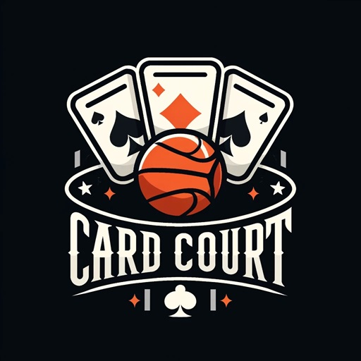
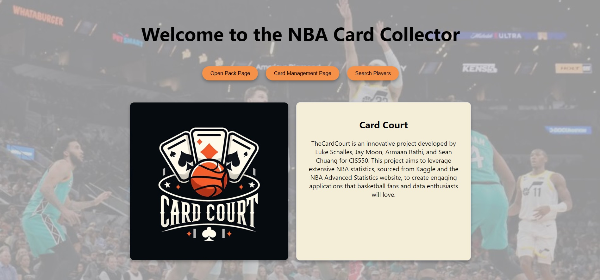
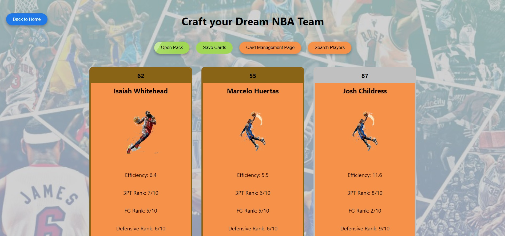
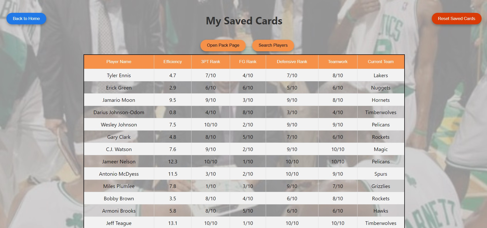
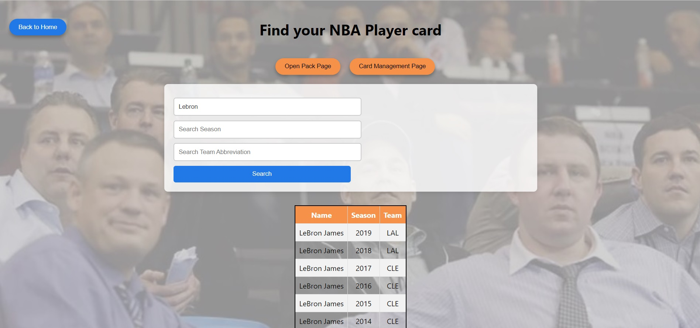

## Table of Contents

1. [Introduction](#introduction)
2. [Documentation](#documentation)
3. [Screenshots](#screenshots)
4. [Credits](#credits)

## Introduction

**Project Goals and Target Problem:**
CardCourt is designed to revolutionize the way basketball card collectors and enthusiasts interact with their collections digitally. Our project aims to address the inefficiencies in traditional card trading and management by providing a streamlined, interactive platform that not only allows users to manage their collections but also enhances their engagement through dynamic content such as player stats, game summaries, and more. The primary goal is to create an intuitive application that simplifies data access, enhances user experience, and makes the management of card collections as engaging as watching live sports.

**Description of Application Functionality:**
CardCourt consists of three main each facilitated through a dedicated page:
1. OpenPackPage: Provides a fun and interactive way for users to "open" digital packs of cards, adding an element of surprise and excitement similar to physical card collecting. The cards opened here are saved into a database, enabling easy access and management.
2. ManagementPage: Designed for efficient management of the user’s collection. It directly interacts with the 'SavedCards' table in the database where the opened cards from the OpenPackPage are stored. This setup significantly optimizes data retrieval processes, making the user experience smoother and more responsive.
3. SearchPage: Allows users to search for specific player cards based on various criteria such as player name, team, or season. This page utilizes complex SQL queries to fetch data from a comprehensive database that includes player details, team stats, game summaries, and more.

The application backend is powered by a MySQL database, structured to store extensive data across multiple tables including ‘Teams, Players, Games_summary, Games_details, and Rankings’. This data is manipulated and accessed through various SQL operations embedded within our server routes, ensuring that data handling is both efficient and secure. There is also a feature-specific table that stores the ‘opened NBA player cards,’ which is a unique aspect of our application.

Each interaction on the frontend triggers specific SQL queries that interact with the database to retrieve or manipulate data as required, ensuring real-time data access and updates. This architecture not only supports robust data handling but also ensures that the application scales well with increasing data and user base.

In summary, CardCourt aims to bridge the gap between digital and physical card collecting, providing a platform that is both enjoyable for enthusiasts and robust enough for serious collectors, all while ensuring data integrity and performance.

## Documentation

### Home Page

Upon entering CardCourt, users are greeted by the home page which serves as the central hub for navigation within the app. This page provides quick access to key features including a search function, opening card packs, and managing the card collection. Prominent buttons direct users to the "Search Players," "Open Pack Page," and "Card Management Page," allowing for intuitive navigation through the app's primary functionalities.

### Open Pack Page

The Open Pack Page offers an engaging experience where users can "open" digital packs to discover random NBA player cards. Each session of opening a pack triggers a dynamic presentation of player cards, complete with details such as player efficiency, ranks in various stats, and current team information. Users can save cards to their personal collection directly from this page, enhancing their interactive experience with the excitement of collecting.

### Management Page

On the Management Page, users can efficiently manage their saved collection of player cards. This page lists all cards that users have saved, displaying detailed attributes such as player name, efficiency scores, and various performance ranks. Users can sort this list based on different attributes to organize their view. Additionally, there is functionality to reset the collection by clearing all saved cards, with immediate updates reflected on the page.

### Search Page

The Search Page allows users to explore NBA player cards by entering specific criteria such as player name, season, or team abbreviation. Upon entering the search terms and initiating the search, the page displays up to a dozen player cards at a time. Each card provides brief but informative details about the player, and the user can initiate a new search at any time by entering new criteria and pressing the "Search" button or hitting "ENTER."

## Screenshots

### Home Page

### Open Pack Page with Open Pack button and Animation

### Management Page with Reset button

### Search Page

## Credits

Luke Schalles: https://github.com/lukeschalles

Armaan Rathi: https://github.com/armaan-rathi

Jay Moon: https://github.com/solar268

Sean Chuang: https://github.com/sungenchuang7